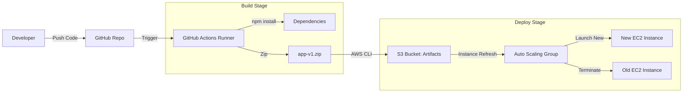

# 🚀 CI/CD Pipeline Documentation

## Overview
The Teamfolio project utilizes **GitHub Actions** to implement a Continuous Deployment (CD) pipeline. This ensures that every merge to the `main` branch is automatically built, packaged, and deployed to the AWS production environment without human intervention.

*   **Workflow File:** `.github/workflows/deploy.yml`
*   **Trigger:** Push to `main` branch.
*   **Environment:** AWS (Canada Central).

## 🔄 Pipeline Architecture



## 🔐 Security & Credentials
We utilize **GitHub Secrets** to securely store AWS credentials. These are injected into the runner environment at runtime and are never exposed in the codebase.

| Secret Name | Purpose |
| :--- | :--- |
| `AWS_ACCESS_KEY_ID` | IAM User Access Key for `github-actions-user`. |
| `AWS_SECRET_ACCESS_KEY` | IAM User Secret Key. |

*The IAM User is restricted to `AmazonS3FullAccess` and `AutoScalingFullAccess` (Least Privilege).*

## 🛠 Pipeline Steps Explained

1.  **Checkout Code:** Pulls the latest code from the repository.
2.  **Setup Node.js:** Installs Node v16 to prepare the build environment.
3.  **Install Dependencies:** Runs `npm install` to ensure `package-lock.json` is valid.
4.  **Create Artifact:** Zips the `app/` directory (excluding `node_modules`) into `app-v1.zip`.
5.  **Upload to S3:** Uses AWS CLI to upload the zip file to the Artifact Bucket.
6.  **Refresh ASG:** Triggers an **Instance Refresh** on the Auto Scaling Group with a 300s warmup period.

## 🚑 Troubleshooting & Rollback

### How to check deployment status
1.  Go to the **Actions** tab in the GitHub Repository.
2.  Click on the latest workflow run.
3.  **Green Check:** Success. AWS is currently rolling out new instances.
4.  **Red X:** Failure. Click the job to view logs.

### Common Errors
*   **"Access Denied" on S3 Upload:** Check if the IAM User keys in GitHub Secrets are active.
*   **"No such file":** Ensure the `app/` folder structure has not changed.

### Manual Rollback Procedure
If a bad deployment breaks the site:
1.  Revert the change in `index.html` locally.
2.  Commit and push to `main` ("Revert commit").
3.  The pipeline will run again and deploy the previous working version.
```