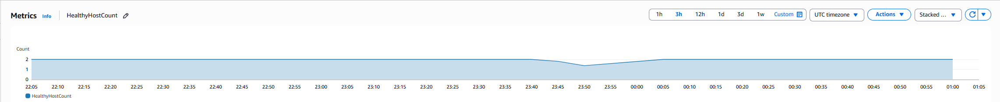
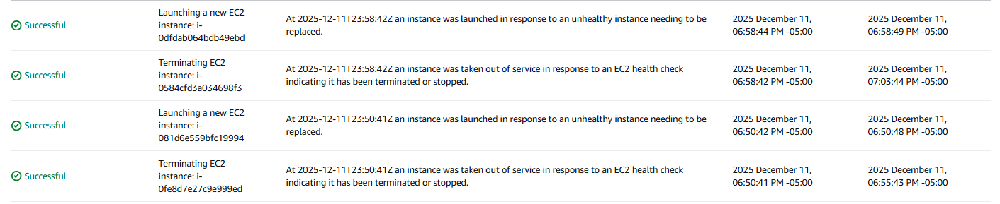

# 📝 Incident Post-Mortem: Deployment Instability & Recovery

**Date:** December 11, 2025
**Incident ID:** DEP-FAIL-001
**Severity:** Sev-2 (Deployment Blocked / Stale Content)
**Status:** ✅ Resolved
**Lead:** Brandon Randell

## 1. Executive Summary
During the scheduled release of the "Individual Portfolio" feature set, the production environment experienced a **Deployment Failure**. Although the CI/CD pipeline reported a "Success" status, the Auto Scaling Group (ASG) failed to stabilize the new instances due to a Node.js version mismatch in the boot script.

This resulted in the Load Balancer continuing to serve traffic from older, "stale" instances (Race Condition) and causing capacity fluctuations as new instances failed health checks immediately upon launch.

## 2. Impact Analysis
*   **Service Health:** Degraded. The cluster capacity fluctuated between 1 and 2 healthy hosts for approximately 2 hours as the ASG attempted to heal.
*   **User Experience:** Users viewed outdated content (v1.0) despite v1.1 being "deployed."
*   **Resolution:** Root cause identified (User Data script error). Logic fixed (Wait steps added to pipeline). Service stabilized at full capacity (2/2) by 20:00 EST.

## 3. Observability Evidence

### Evidence A: CloudWatch Metrics

> **Figure 1:** *`HealthyHostCount` metric showing instability. The graph illustrates the drop in capacity as faulty instances failed health checks, followed by stabilization at 2/2 once the User Data fix was applied.*

---
### Evidence B: Auto Scaling Logs

> **Figure 2:** *Auto Scaling Activity History confirming the loop of instance terminations and new launches. This validates that the Self-Healing architecture was actively trying to replace the broken nodes.*

## 4. Root Cause Analysis (5 Whys)
1.  **Why did the deployment fail?**
    New EC2 instances failed Application Load Balancer (ALB) health checks immediately upon boot.
2.  **Why?**
    The application crashed on startup. The `npm` dependencies required Node v16, but the Amazon Linux 2023 default installed Node v18.
3.  **Why did the pipeline say "Success"?**
    The AWS API call to `start-instance-refresh` is asynchronous. GitHub considered the *request* successful, ignoring the *actual result* of the server boot process.
4.  **Why did users see old content?**
    A race condition occurred. CloudFront cached the content from the old servers while the new servers were still failing to boot.

## 5. Lessons Learned & Corrective Actions
*   **Configuration as Code:** User Data scripts must explicitly define software versions (e.g., `setup_16.x`) rather than relying on `yum install nodejs` defaults to prevent version drift.
*   **Pipeline Logic:** We added a synchronization step (`sleep 310`) to the GitHub Action. This forces the pipeline to wait for the ASG to fully stabilize before declaring the deployment complete and invalidating the cache.

---
**Signed:**
*Brandon Randell, Cloud Architect*